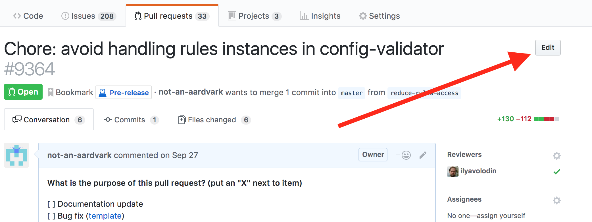

# commit-message status check

## Background

`eslint-github-bot`'s commit message check ensures that all pull requests which get merged into `main` have a valid commit message, based on [ESLint's commit message guidelines](https://eslint.org/docs/developer-guide/contributing/pull-requests#step-2-make-your-changes).

The ESLint team uses GitHub's "Squash and Merge" feature to merge pull requests. When using this feature, the default commit message for the squashed commit is the title of the pull request. To minimize the risk of an incorrect commit message getting merged into `main`, `eslint-github-bot` checks the title.

## How do I fix it?

If this status check is failing on your pull request, you should fix your pull request title on github.com to conform to [ESLint's commit message guidelines](https://eslint.org/docs/developer-guide/contributing/pull-requests#step-2-make-your-changes).

